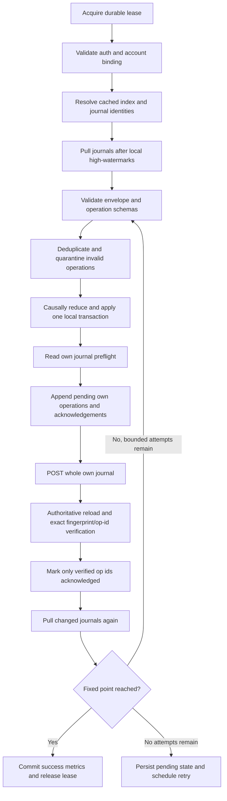

## Context

The retained branch foundation can encode `BackupModels`, create/read/edit/delete Yamibo blogs, parse Discuz prompt errors, discover type-safe blog ids, and verify a write by authoritative reload. The abandoned sync layer treated one config blog as a whole mutable snapshot and attempted to decide whether local or cloud state was newer. That model failed for reset installations, concurrent edits, deletion, and Yamibo's lack of server-side compare-and-swap.

Yamibo blog writes are whole-document form posts. Two devices that read one shared blog and then edit it can silently overwrite each other's changes even if both clients perform a preflight fingerprint check. The transport therefore cannot safely be used as a multi-writer log.

The new design borrows established local-first principles: durable local writes, an upload queue, idempotent operation identifiers, explicit deletion, causal comparison, field-level policies, and deterministic convergence. It does not copy a managed sync engine's server assumptions because Yamibo remains a non-transactional blog transport.

Confirmed product decisions:

- One private journal blog per device is acceptable.
- Truly concurrent writes to the same field use a deterministic winner and retain the losing operation in history.
- A device becomes inactive after 90 days without a verified journal heartbeat.
- Payload confidentiality encryption is not required. Existing JSON/Gzip/Base64 encoding is serialization only.

## Goals / Non-Goals

**Goals:**

- Reach automatic convergence without user choice for at least 99% of eligible sync sessions.
- Never infer deletion from absence, an empty database, a reset installation, or a failed cloud read.
- Never lose an acknowledged operation because of retry, process death, duplicate delivery, journal races, or compaction.
- Make every conflict rule centralized, deterministic, testable, and independent of device wall-clock accuracy.
- Keep normal local writes available offline and publish them when authentication/network/background execution permits.
- Reuse the existing typed Yamibo blog transport and `BackupModels` data projection.
- Keep the cloud-sync screen informative without making it a conflict-resolution console.

**Non-Goals:**

- Mathematical guarantees against Yamibo account loss, server corruption, manual blog edits, or a permanently unavailable provider.
- Real-time sync or guaranteed operating-system background launch time.
- End-to-end encryption, key management, or claims that Base64 hides content.
- Collaborative text CRDT behavior.
- Manual conflict selection for ordinary same-field conflicts.
- Routine Merge/Overwrite selection during automatic sync.
- Automatic deletion of a cloud journal merely because it is missing from an index or cannot be loaded.

## Decisions

### 1. Make operations the source of convergence

Every syncable user mutation produces a durable `SyncOperation`:

```text
SyncOperation
├── opId = DeviceId + DeviceEpoch + Sequence
├── accountBinding
├── domainId
├── entityId
├── kind = Put | Patch | Delete | RelationAdd | RelationRemove
├── field/value payload or tombstone
├── causalContext = observed high-watermark per device epoch
├── createdAtEpochMillis              # diagnostics only
├── origin = UserAction | Migration | RemoteReplay
└── schemaVersion
```

`Sequence` is allocated monotonically in SQLDelight. `opId` is globally stable and retries reuse it. An incoming operation is applied at most once by an `AppliedOperation` primary key.

Domain data and its outbox operation must commit atomically. SQL-backed domains use one database transaction. Syncable settings that currently live outside SQL must move behind a SQL-backed canonical sync setting store, with the platform setting projection repaired idempotently after commit. A crash must not leave a visible setting mutation without an operation.

`BackupModels` remain the canonical full-state projection for export, manual recovery, and checkpoint construction. They are not used to infer incremental changes or deletions.

Alternative: diff two `BackupModels` snapshots. Rejected because absence remains ambiguous and a reset database appears as a mass deletion.

### 2. Use a single-writer cloud journal per device epoch

Cloud topology:

```text
Yamibo account
├── config/index blog                 # account marker and advisory discovery cache
├── device journal A                  # written only by device epoch A
├── device journal B                  # written only by device epoch B
├── device journal C                  # written only by device epoch C
└── immutable checkpoint blogs        # created uniquely; never edited in place
```

Each journal title includes a collision-resistant app prefix and device-epoch suffix. Its envelope contains the fixed marker, schema, account binding, device id/epoch, writer-instance nonce, contiguous sequence range, operations, heartbeat, checkpoint acknowledgements, and deterministic fingerprint.

A device never edits another device's journal. Foreground and background work for the same installation share one durable SQL lease and an in-process mutex. Device identity is stored in non-backup installation storage where available. If a restored/cloned installation detects a different writer-instance nonce for its device epoch, it rotates to a new epoch before publishing.

This converts Yamibo's unsafe multi-writer document into several single-writer documents. A whole-blog race can still happen between two processes of the same installation; the lease, stable operation ids, preflight read, and post-write verification make that recoverable.

Alternative: append all devices to one blog. Rejected because Discuz exposes no atomic append or CAS.

### 3. Treat the config/index blog as advisory

The config/index blog stores the account marker, supported schema range, known journal references, newest verified checkpoint references, and discovery metadata. It accelerates loading but is not authoritative for operation existence, device retirement, or deletion.

Known valid blog ids are cached locally. Opening the cloud-sync page reads cached status and may schedule refresh; it does not scan all user blogs on every visit. A full `fetchUserSpaceMyBlogs(userId = null)` discovery runs when:

- no valid local identity exists;
- a cached blog returns a verified missing/wrong-identity result;
- the index references an unknown journal;
- the last full discovery is older than 24 hours;
- the user explicitly refreshes or repairs cloud data.

Concurrent index updates may lose a reference, so all matching journal markers found by periodic discovery are unioned with cached/index references. Missing index membership never deletes a journal or local operation.

Alternative: trust only the index. Rejected because the index itself is a shared whole-document write.

### 4. Use causal high-watermarks and deterministic ties

Each device stores the highest contiguous sequence observed for every device epoch. An operation carries the high-watermarks observed before it was created.

Comparison:

1. If operation B's causal context includes A, B happened after A.
2. If A includes B, A happened after B.
3. If neither includes the other, they are concurrent.
4. Concurrent operations use the domain policy.
5. If a scalar policy needs one winner, compare the stable `opId` bytes; all devices therefore choose the same winner.

Wall-clock time is retained for display, diagnostics, retention estimates, and user history. It never proves causal freshness and never independently permits deletion or compaction.

The losing concurrent operation remains in `ConflictHistory` with winner id, policy id, and resolution reason. It does not require a UI decision.

Alternative: hybrid logical clock only. Rejected as the primary conflict detector because ordering concurrent operations does not tell the resolver that they were concurrent. A deterministic tie-breaker is still used after causal detection.

### 5. Centralize domain conflict policies

Every synced domain registers stable identity, operation schema, validation, reducer, delete authority, and conflict policy. Unregistered domains or policy versions fail closed and are quarantined.

Initial policy matrix:

| Domain | Identity | Concurrent policy |
|---|---|---|
| Settings | stable setting key | per-key register; causal successor wins; concurrent `opId` winner |
| Reading progress/history | stable content/history id | causal successor wins; concurrent progress uses domain monotonic rule where valid, otherwise `opId` winner |
| Favorite item | stable remote/content id | per-field register; unrelated fields merge |
| Category/collection | generated stable sync id | name is a field, never identity; per-field register |
| Membership relation | item id + container sync id | remove-wins for true concurrent add/remove |
| Record deletion | stable entity id | explicit tombstone; remove-wins against a truly concurrent update unless domain contract explicitly supports resurrection |

A later edit causally based on a tombstone may recreate an entity only through an explicit user creation action with a new entity generation. Replaying an old put cannot resurrect it.

Alternative: one global LWW comparator. Rejected because relation removal, progress, settings, and entity deletion have different semantics.

### 6. Make deletion explicit and bulk deletion guarded

Only an explicit local user action can emit `Delete` or `RelationRemove`. Database recreation, logout, account switch, migration failure, restore failure, cloud load failure, and a missing row during snapshot projection are never delete sources.

Single deletes apply automatically through tombstones. A locally confirmed bulk action receives a durable `BulkDeleteAuthorization` containing scope, operation count/range, and expiry. Each emitted delete also carries the same minimal authorization proof so another device can validate the batch without access to the origin device's SQL row. Expiry is checked against operation creation time, not delayed cloud-receipt time; the proof contains no user content or credential. The operations may then sync without a second cloud-time prompt.

An unapproved batch affecting more than both a configured absolute count and percentage threshold is quarantined before local or cloud destructive apply. The initial implementation derives conservative thresholds from domain fixtures and records them centrally. Automatic revalidation may release a batch only when its origin and authorization are intact. Otherwise the UI reports that manual attention is required; unrelated operations continue.

Alternative: block every deletion for confirmation during sync. Rejected because it would prevent the 99% no-intervention objective and duplicate confirmation already obtained at the user action.

### 7. Bootstrap fresh, reset, corrupted, and inactive devices

Installation state is explicit:

```text
Unbound -> Bootstrapping -> Active -> Inactive/RebootstrapRequired
                         \-> PausedAuth / PausedProvider / Quarantined
```

A device enters `Bootstrapping` when it has no verified account binding, its database generation changes, sync metadata is missing/corrupt, or it returns after more than 90 days without a verified cloud heartbeat.

Bootstrap is pull-only:

1. Discover and validate config, journals, and newest safe checkpoint.
2. Load the checkpoint and every operation above its vector.
3. Validate, deduplicate, resolve, and apply in one recoverable local transaction sequence.
4. Re-read local state and verify high-watermarks.
5. Create a new device epoch and journal.
6. Enter `Active`; only then can local pending operations publish.

Pre-existing local user data is represented as explicit migration/import operations after cloud bootstrap and then merged normally. An almost-empty database never uploads as authoritative state.

An active device crossing the 90-day threshold is excluded from future compaction acknowledgements. If it returns, it must adopt the retained checkpoint and rotate epoch; its old journal can be read for history but cannot resume publication.

### 8. Run pull, reduce, publish, verify, and pull again

One serialized sync cycle:



The POST response is only an acknowledgement hint. Pending operations remain pending until authoritative reload contains their exact ids and expected payload fingerprint. Unknown results retry idempotently.

Remote application and high-watermark advancement occur in the same SQL transaction. A malformed journal quarantines that journal version without modifying valid local data or deleting cloud content.

Foreground manual sync and platform background tasks submit triggers to the same runtime and lease. Existing WorkManager/iOS background adapters are reused as scheduling entry points; they do not contain merge policy.

### 9. Compact through immutable verified checkpoints

Operation history cannot grow without bound, but pruning by age alone is unsafe.

Checkpoint protocol:

1. A device deterministically reduces all observed operations and creates a uniquely named immutable checkpoint blog containing a `BackupModels` projection, full causal vector, tombstones, schema, and fingerprint.
2. It reloads and verifies the checkpoint.
3. Active device journals acknowledge that exact checkpoint id and vector.
4. Only after every device active within the previous 90 days has acknowledged it may each device prune its own operations at or below the checkpoint vector.
5. The checkpoint and enough predecessor metadata remain retained. It is never overwritten in place.
6. A later checkpoint can supersede it only after completing the same acknowledgement protocol.

Competing checkpoint candidates are harmless: devices select a candidate whose vector dominates their required base, then converge on the deterministic highest `(coverage vector, checkpoint id)` candidate. No operation is pruned merely because a new candidate exists.

Tombstones remain in checkpoints until a later checkpoint proves all active devices observed them and the retention floor has passed. Storage pressure pauses compaction/upload with a typed status; it does not silently drop history.

Alternative: keep one editable snapshot blog. Rejected because a later stale writer could replace the only recovery base.

### 10. Define success and failure precisely

Operation lifecycle:

- `PendingLocal`: committed locally, not verified remotely.
- `PublishedUnverified`: POST may have succeeded; reload not yet conclusive.
- `Acknowledged`: exact operation verified in its owner journal.
- `AppliedRemote`: reducer committed it locally.
- `Quarantined`: preserved but excluded from reduction with typed reason.
- `Compacted`: covered by a retained verified checkpoint.

Failure rules:

- Auth/formhash expiry pauses cloud I/O, preserves pending operations, and prompts the existing manual login refresh path.
- Timeout, maintenance, rate limit, or transient HTTP failure persists pending work and applies bounded exponential backoff with jitter.
- Illegal request, permission failure, unsupported schema, identity mismatch, or semantic validation failure pauses the affected path and exposes details.
- Cloud-load failure cannot mutate/delete config identity, local domain state, journals, or checkpoints.
- One corrupt journal cannot block application of valid journals.
- No exception path marks an operation acknowledged before verified reload.
- UI success/failure appears as page-local durable status, not Snackbar.

### 11. Measure the 99% objective without overstating guarantees

An eligible sync demand is a dirty or remote-change trigger where:

- cached authentication and formhash are valid;
- the account is unchanged;
- Yamibo is reachable and accepts authorized blog reads/writes during the observation window;
- all required payload schemas are supported;
- cloud blogs were not manually edited/deleted;
- the OS grants either 15 minutes of foreground network opportunity or two background execution windows within 24 hours.

Success means the device reaches a fixed point, every locally pending operation is either verified acknowledged or explicitly quarantined, and all fetched valid operations are applied, without user conflict choices. The rolling target is at least 99% successful eligible demands and less than 1% requiring manual intervention.

Data durability is a separate invariant, not a percentage target: tests and telemetry must show zero known loss of acknowledged operations. True concurrent edits do not have an objective "latest" value; correctness means deterministic convergence plus retained loser history.

Metrics contain counts, phase, durations, typed errors, retry count, causal vectors, and hashed ids. They must not contain cookies, formhash, journal values, user content, or raw account identifiers.

### 12. Planned file structure

```text
shared/src/commonMain/kotlin/me/thenano/yamibo/yamibo_app/
├── repository/appsync/
│   ├── operation/
│   │   ├── SyncOperation.kt
│   │   ├── SyncOperationId.kt
│   │   ├── SyncCausalContext.kt
│   │   └── SyncOperationCodec.kt
│   ├── domain/
│   │   ├── SyncDomainContract.kt
│   │   ├── SyncDomainRegistry.kt
│   │   └── policies/
│   ├── engine/
│   │   ├── OperationSyncEngine.kt
│   │   ├── OperationReducer.kt
│   │   ├── BootstrapCoordinator.kt
│   │   └── CheckpointCoordinator.kt
│   ├── remote/
│   │   ├── AppSyncBlogProvider.kt              # retained transport
│   │   ├── YamiboAppSyncBlogProvider.kt        # retained transport
│   │   ├── AppSyncJournalClient.kt
│   │   ├── AppSyncDiscoveryClient.kt
│   │   └── AppSyncJournalEnvelopeCodec.kt
│   └── model/
│       ├── AppSyncDevice.kt
│       ├── AppSyncRunResult.kt
│       └── AppSyncQuarantine.kt
├── repository/backup/
│   ├── BackupModels.kt                         # retained checkpoint projection
│   └── CloudBackupPayloadCodec.kt              # retained serialization
└── store/appsync/
    ├── AppSyncOperationStore.kt
    ├── AppSyncDeviceStore.kt
    ├── AppSyncCheckpointStore.kt
    └── AppSyncTelemetryStore.kt

shared/src/commonMain/sqldelight/me/thenano/yamibo/yamibo_app/
├── AppSyncOperation.sq
├── AppSyncDevice.sq
├── AppSyncCheckpoint.sq
└── migrations/<next>.sqm

composeApp/src/commonMain/kotlin/me/thenano/yamibo/yamibo_app/
├── appsync/
│   ├── AppSyncRuntime.kt
│   └── AppSyncBackgroundScheduler.kt
└── profile/settings/cloud/
    ├── AppSyncSettingsScreen.kt                # retained UI shell
    └── AppSyncCoordinator.kt                   # page-local status adapter

composeApp/src/androidMain/.../appsync/
├── AndroidAppSyncRuntimeProvider.kt
└── AppSyncWorker.kt

composeApp/src/iosMain/.../appsync/
├── IOSAppSyncRuntimeProvider.kt
└── IOSAppSyncBackgroundBridge.kt

shared/src/commonTest/.../repository/appsync/
├── OperationSyncEngineTest.kt
├── ConflictPolicyMatrixTest.kt
├── BootstrapSafetyTest.kt
├── JournalRaceFailureTest.kt
├── CheckpointCompactionTest.kt
└── MultiDeviceConvergencePropertyTest.kt
```

## Risks / Trade-offs

- [More private blogs increase account clutter] -> Use unmistakable names, private visibility, cached ids, and a cloud-data cleanup workflow that deletes only verified app markers after explicit confirmation.
- [Yamibo may impose unknown body or blog-count limits] -> Measure limits before enabling compaction, batch journal segments if required, and fail closed on storage pressure.
- [Index writes can race] -> Keep index advisory and periodically union full discovery results.
- [A device journal can still race with its own restored clone] -> Store identity outside backup, include writer nonce, detect collision, and rotate epoch.
- [Causal vectors grow with device count] -> Compact retired epochs into checkpoint vectors after the 90-day protocol; optimize encoding only after correctness tests.
- [Moving settings into transactional storage is invasive] -> Migrate one registry-backed adapter at a time and keep idempotent projections for existing consumers.
- [Remove-wins may discard a concurrent intended edit] -> Preserve the losing operation and require explicit post-delete recreation with a new generation.
- [Compaction is operationally expensive] -> Keep it infrequent and verified; prefer storage growth or paused sync over unsafe pruning.
- [99% depends on provider and OS opportunity] -> Publish the denominator/exclusions and report both eligible-demand success and raw sync availability.
- [No encryption exposes payload to the account/provider] -> Mark blogs private, exclude secrets/auth data, and describe compression/base64 accurately.

## Migration Plan

1. Freeze the old snapshot upload/download decision classes and prevent automatic upload from this branch.
2. Inventory all current `BackupModels` fields and assign each one a domain id, stable entity id, operation shape, and conflict policy.
3. Add SQLDelight device, outbox, applied-operation, causal-vector, conflict-history, quarantine, checkpoint, and telemetry storage with migration tests.
4. Route every syncable local mutation through a transactional domain command that also appends its operation.
5. Implement pure operation ordering/reducers and exhaustive policy tests before network wiring.
6. Add journal/index/checkpoint codecs and adapt the retained blog provider to distinct fixed markers and private titles.
7. Implement cached discovery, per-device journal publish/reload verification, bootstrap, bounded pull-again convergence, and typed retry.
8. Implement immutable checkpoints and acknowledgement-gated compaction only after provider-size measurements and failure tests pass.
9. Wire the existing background scheduling system and retained cloud-sync UI to the new runtime; keep automatic sync disabled by migration default.
10. Run deterministic 2-5-device model/property tests with reordered, duplicated, dropped, delayed, and concurrently delivered operations.
11. Run process-death, expired-formhash, database-reset, 90-day-return, journal-corruption, index-race, and compaction failure tests.
12. Enable automatic sync behind a feature flag, observe eligible-demand metrics, then remove the old routine Merge/Overwrite implementation only after the target and durability invariant are met.

Rollback disables scheduling and publication but leaves operation/outbox tables and journal blogs intact. A rollback build may continue local app behavior and manual `BackupModels` export; it must not reinterpret journals as old snapshots or delete them.

## Manual Authority Overrides

Force push and force pull are recovery tools, not alternative automatic merge
policies. The page first performs a read-only authoritative load, validates all
journals/checkpoints, reduces cloud state, and compares semantic resolved state
with the current local resolved state. The preview groups differences by domain
and action and hashes canonical local and cloud representations into an opaque
token.

The confirmation dialog uses Yamibo theme controls, displays the comparison,
and disables the destructive confirmation for 10 seconds. Confirmation reloads
the cloud and recomputes the token. A mismatch aborts without mutation and asks
the user to review a new preview.

Force push treats the local sync scope as authoritative. It emits causally
later Put/Patch/Relation operations for local values and authorized Delete or
RelationRemove operations for cloud-only values. Those operations use the
ordinary journal publication, authoritative reload, and exact operation-id
acknowledgement path.

Force pull treats the fully validated cloud reduction as authoritative. In one
database transaction it replaces resolved/domain projections, advances remote
causal metadata, and marks unpublished local outbox rows as discarded by the
manual force pull. A failed load, validation, or transaction leaves both
resolved state and domain projections unchanged. Discarded rows are excluded
from all later publication and fixed-point checks.

The latest successful run also retains privacy-safe change summaries grouped by
direction, domain, and action. The UI maps domain ids to user-facing module
labels and shows add/update/delete/enable/disable counts. It never displays raw
entity ids, field payloads, or operation bodies. Epoch-millisecond status values
are formatted using the app's shared date-time formatter.

## Open Questions

- Measure Yamibo's safe blog body size, maximum practical private-blog count, pagination behavior, and rate limits before selecting journal segment and checkpoint thresholds.
- Set per-domain suspicious bulk-delete absolute/percentage thresholds from current fixture distributions before implementation leaves the feature flag.
- Decide the minimum retained checkpoint/tombstone history after provider-limit measurements; correctness takes priority over a fixed time-based deletion policy.
